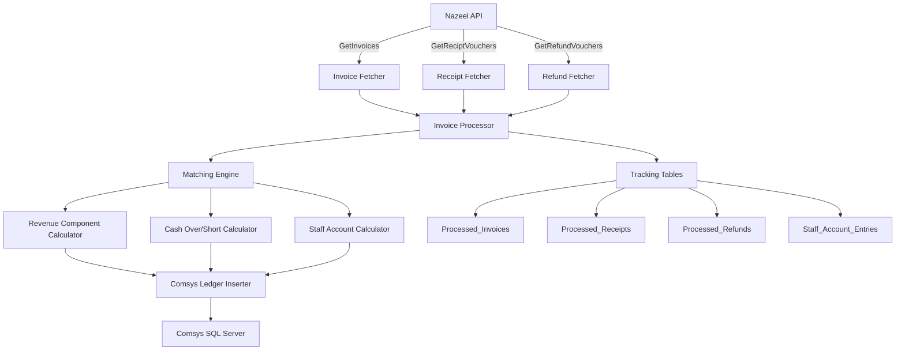

# Nazeel to Comsys Integration

## Overview
Deployed in production for a multi-property hotel group in Madinah, automating daily reconciliation previously done manually

This repository contains a Python integration script for transferring financial transaction data from the Nazeel API into the Comsys SQL Server database.

- fetch invoices, receipt vouchers, and refund vouchers from the Nazeel API
- match receipts and refunds against invoice amounts
- calculate revenue, cash over/short, guest ledger balances, and staff account shortages
- insert appropriate accounting entries into Comsys `FhglTxHed` and `FhglTxDed` tables
- track processed invoices, receipts, refunds, and staff account entries to avoid duplicates

## Problem Solved

This script solves a recurring reconciliation and integration problem for hotel guest ledger transactions:

- Nazeel provides invoices, receipts, and refund vouchers as separate API data sources
- Comsys requires balanced accounting entries posted by revenue date
- Manual matching and posting is error-prone and time-consuming
- Refunds, partial payments, overpayments, and underpayments need special handling
- Duplicate processing of the same invoices or vouchers must be prevented

By automating this workflow, the script ensures consistent posting of revenue and payment data into Comsys while preserving audit history.

## Key Features

- API integration with Nazeel for:
  - invoices
  - receipt vouchers
  - refund vouchers
- Duplicate prevention using tracking tables:
  - `Processed_Invoices`
  - `Processed_Receipts`
  - `Processed_Refunds`
  - `Staff_Account_Entries`
- Refund voucher support and refund matching
- Payment matching tolerances for:
  - exact matches
  - small underpayments
  - large underpayments requiring staff account handling
  - overpayments routed to cash over/short
- Revenue component extraction for:
  - individual rate revenue
  - VAT
  - municipality tax
  - penalties
- Comsys journal entry creation in:
  - `FhglTxHed`
  - `FhglTxDed`
- Date range filtering and CLI options

## Architecture Diagram



## How it Works

1. The script initializes and ensures the required tracking tables exist in the SQL Server database.
2. It requests data from Nazeel for invoices, receipts, and refunds within a specified date range.
3. It filters out already-processed invoices, receipts, and refunds.
4. It groups transactions by revenue date.
5. It matches invoices with receipts and refunds using reservation numbers.
6. It computes revenue components, cash over/short, guest ledger, and staff account entries.
7. It writes accounting entries to Comsys and records processed transactions in tracking tables.

## Usage

Run the script from the repository root or from the `Scripts` folder:

```bash
python Scripts/run.py
```

Optional arguments:

- `--start-date` `YYYY-MM-DD HH:MM:SS`
- `--end-date` `YYYY-MM-DD HH:MM:SS`
- `--days` `<number>`

Example:

```bash
python Scripts/run.py --days 30
```

## Configuration

Update the connection and API settings inside `Scripts/run.py`:

- `API_KEY`
- `SECRET_KEY`
- `BASE_URL`
- `CONNECTION_STRING`
- `LOG_FILE`

## Notes

- The script currently uses a generated `authKey` based on the secret key and today's date.
- It assumes Comsys journal validation is performed by the local `FGnrJour` table.
- The `generate_docu()` method currently returns a static value and can be extended to support dynamic document numbering.

---

For more details, inspect nazeelToComsys.py and the logging output at the configured LOG_FILE path.
